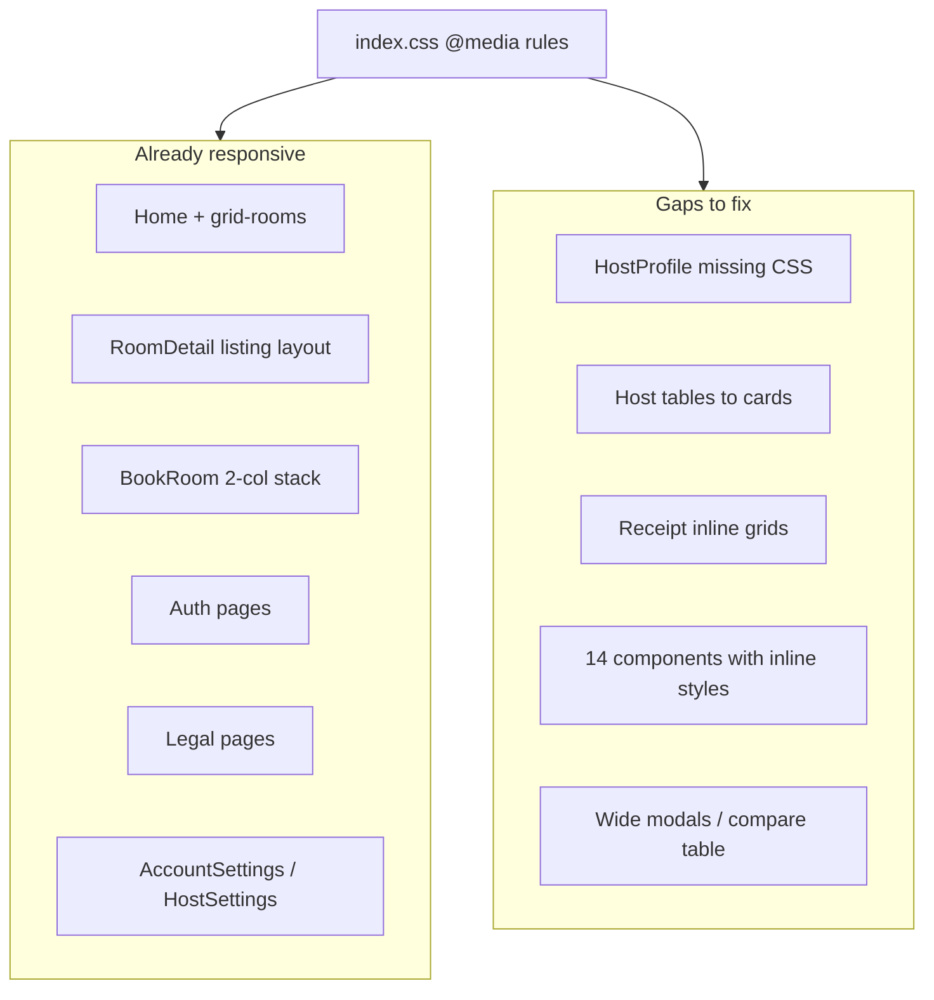

# Make All Pages and Components Responsive

## Current state

StayEase already has a **global responsive system** in [`frontend/src/index.css`](frontend/src/index.css) (~13k lines, 32 `@media` blocks). Pages and components use **BEM class names**, not Tailwind. Mobile chrome (`MobileBottomNav`, `MobileSearchModal`, `hide-mobile` / `hide-desktop`) exists and works.

Per [`prompt.md`](prompt.md) line 1592: *"Mobile responsive (flexbox + grid, no libraries)."*

**~70% of pages are already responsive** via shared primitives (`page`, `grid-rooms`, `listing-page`, `host-dashboard__*`, `account-settings`, `legal-page`, etc.). The remaining work is **gap-filling and bug fixes**, not a rewrite.



---

## Strategy

1. **Keep the existing architecture** — add/fix CSS in `index.css`, minimal JSX changes only where markup must change (e.g. table → card pattern).
2. **Standardize breakpoints** at the top of `index.css`:

```css
:root {
  --bp-mobile: 768px;   /* primary phone breakpoint */
  --bp-tablet: 900px;   /* split layouts (listing, editor, settings) */
  --bp-desktop: 1024px; /* host KPI grids */
}
```

   Align inconsistent `767px` / `769px` usages (e.g. [`RoomImageCarousel.jsx`](frontend/src/components/RoomImageCarousel.jsx), calendar popovers) to `768px`.

3. **Target viewports**: 320px (iPhone SE), 375px, 768px (tablet), 1024px+ (desktop).
4. **No new CSS libraries** — flexbox, CSS grid, `clamp()`, `min()`, `env(safe-area-inset-bottom)`.

---

## Phase 1 — Critical broken layouts (highest impact)

### 1.1 HostProfile page — missing CSS classes

[`HostProfile.jsx`](frontend/src/pages/guest/HostProfile.jsx) uses `host-profile-hero`, `host-profile-stats`, `host-profile-grid`, `host-profile-panel`, etc., but **`index.css` defines different names** (`host-hero`, `host-stat-tile`, `host-bento`) with **zero rules** for the JSX classes.

**Fix:** Add a full `host-profile-*` block in `index.css`:
- Hero: flex row → column at `600px`; avatar scales; badges wrap
- Stats: `repeat(4, 1fr)` → `repeat(2, 1fr)` at `640px` → `1fr` at `480px`
- Main grid: `1.15fr 1fr` → single column at `900px`
- Listings: reuse existing `grid-rooms` (already 1-col at `768px`)

### 1.2 Receipt page — inline fixed grids

[`Receipt.jsx`](frontend/src/pages/guest/Receipt.jsx) uses inline `gridTemplateColumns: '1fr 1fr'` and flex headers with no mobile overrides.

**Fix:** Extract to BEM classes (`.receipt-card`, `.receipt-card__grid`, `.receipt-card__header`, `.receipt-card__footer`) in `index.css`:
- 2-col grids → `1fr` at `max-width: 600px`
- Header/footer flex → `flex-wrap` + stack at `600px`
- Actions row: `flex-wrap` at `768px` (extend existing `.receipt-page__actions`)
- Card padding: `clamp(1rem, 4vw, 2rem)`

### 1.3 Host tables → mobile card rows (user preference)

Affected pages:
- [`ManageBookings.jsx`](frontend/src/pages/host/ManageBookings.jsx)
- [`ManageRooms.jsx`](frontend/src/pages/host/ManageRooms.jsx)
- [`HostDashboard.jsx`](frontend/src/pages/host/HostDashboard.jsx) (recent bookings table)

**Pattern:** Add `data-label` attributes on `<td>` elements + CSS in `index.css`:

```css
@media (max-width: 768px) {
  .trips-table thead { display: none; }
  .trips-table tr { display: block; border: 1px solid var(--border); border-radius: var(--radius-md); margin-bottom: 0.75rem; padding: 0.75rem; }
  .trips-table td { display: flex; justify-content: space-between; padding: 0.35rem 0; }
  .trips-table td::before { content: attr(data-label); font-weight: 600; color: var(--text-muted); }
}
```

Actions column stacks full-width buttons. Remove `white-space: nowrap` override at `768px` for these tables.

---

## Phase 2 — Component gaps

| Component | Issue | Fix |
|-----------|-------|-----|
| [`CompareRoomsModal.jsx`](frontend/src/components/CompareRoomsModal.jsx) | Wide table overflows | `overflow-x: auto` wrapper + optional stacked attribute rows at `768px` |
| [`OfferBanner.jsx`](frontend/src/components/OfferBanner.jsx) | Flex row, no wrap | Add `flex-wrap: wrap` + stack CTA at `600px` in `.offer-banner` |
| [`Modal.jsx`](frontend/src/components/Modal.jsx) | Centered only | `@768px`: `align-items: flex-end`, full-width, `max-height: 92dvh`, rounded top corners |
| [`BookingHistory.jsx`](frontend/src/pages/guest/BookingHistory.jsx) | Trip rows cramped | Add `.profile-trip-row` mobile stack rules (image full-width, actions below) |
| [`HostCalendar.jsx`](frontend/src/pages/host/HostCalendar.jsx) | 7-col cells too narrow | Reduce `min-height`, smaller font, hide secondary labels at `480px` |
| [`FindMyRoom.jsx`](frontend/src/pages/guest/FindMyRoom.jsx) | Tab row doesn't scroll | `overflow-x: auto` + `flex-wrap: nowrap` on `.tabs` |
| [`VerifyIdentity.jsx`](frontend/src/pages/auth/VerifyIdentity.jsx) | No auth wrapper | Wrap in `auth-page` / `auth-card` for consistent padding |
| Error pages ([`NotFound.jsx`](frontend/src/pages/shared/NotFound.jsx), etc.) | Action row no wrap | `flex-wrap: wrap` on `.error-page__actions` |
| [`Notifications.jsx`](frontend/src/pages/shared/Notifications.jsx) | Header doesn't wrap | `flex-wrap: wrap` in scoped styles |
| [`AddRoom.jsx`](frontend/src/pages/host/AddRoom.jsx) | `listing-wizard__lock-options` 2-col | Force `1fr` at `640px` |

### Inline-style components (add `@media` to scoped `<style>` or migrate to `index.css`)

[`AttractionCard.jsx`](frontend/src/components/AttractionCard.jsx), [`ReferralCard.jsx`](frontend/src/components/ReferralCard.jsx), [`PriceBreakdown.jsx`](frontend/src/components/PriceBreakdown.jsx), [`GSTBreakdown.jsx`](frontend/src/components/GSTBreakdown.jsx), [`ImageUploader.jsx`](frontend/src/components/ImageUploader.jsx), [`VideoUploader.jsx`](frontend/src/components/VideoUploader.jsx), [`IdentityVerification.jsx`](frontend/src/components/IdentityVerification.jsx), [`HostPayoutBreakdown.jsx`](frontend/src/components/HostPayoutBreakdown.jsx), [`AvailabilityCalendar.jsx`](frontend/src/components/AvailabilityCalendar.jsx) — audit each for fixed widths; add stack/wrap rules.

### Minor chrome polish

- [`Navbar.jsx`](frontend/src/components/Navbar.jsx) / [`HostTopNav.jsx`](frontend/src/components/host/HostTopNav.jsx): hide secondary links on very narrow screens (`480px`) or shorten labels
- [`FilterBar.jsx`](frontend/src/components/FilterBar.jsx): add mobile-visible "Clear all" (currently `hide-mobile`)
- [`WeatherWidget.jsx`](frontend/src/components/WeatherWidget.jsx): add `.weather-widget` rules (compact row layout)
- [`LiveChat.jsx`](frontend/src/components/LiveChat.jsx): verify no overlap with bottom nav at `320px` (adjust `bottom` offset)

---

## Phase 3 — Page sweep (verify + patch)

Systematic pass at **320 / 768 / 1024px** for all 45 pages. Most need only CSS tweaks, not JSX changes:

**Guest (11):** Home, RoomDetail, BookRoom, BookingHistory, AccountSettings, Wishlist, HostProfile, Messages, FindMyRoom, Receipt

**Host (19):** HostDashboard, Analytics, ManageRooms, ManageBookings, ManageOffers, HostSettings, HostMessages, HostCalendar, AddRoom, EditRoom, RoomForm, ListingEditor, ListingPreferences, ViewYourSpace, Payouts, HostingResources, 4× listing-setup pages

**Auth (4):** Login, Register, ForgotPassword, VerifyIdentity

**Shared (11):** HelpCentre, Notifications, 4× legal, 3× error, 3× help subpages

For each page: confirm no horizontal body scroll, touch targets ≥ 44px, text doesn't overflow, fixed UI (compare bar, wizard footer, cookie banner) respects `safe-area-inset-bottom`.

---

## Phase 4 — Global hardening in `index.css`

Add/reinforce shared utilities:

```css
/* Prevent horizontal overflow sitewide */
.app-layout { overflow-x: clip; }

/* Reusable responsive grids */
.stack-mobile { display: grid; gap: 1rem; }
@media (max-width: 768px) { .stack-mobile { grid-template-columns: 1fr !important; } }

/* Touch-friendly minimum tap targets */
@media (max-width: 768px) {
  .btn, .btn-sm, .tabs button { min-height: 44px; }
}
```

Consolidate duplicate `@media (max-width: 768px)` blocks where practical (group related rules, don't rewrite the whole file).

---

## Testing plan

No existing viewport tests. Manual checklist after implementation:

| Viewport | Key flows |
|----------|-----------|
| 320px | Home search, room detail booking bar, book room form, host drawer nav, receipt |
| 375px | Booking history cards, account settings nav pills, offer banner |
| 768px | Listing editor split, host calendar, compare modal |
| 1024px | Host dashboard KPIs, analytics charts |

Run existing frontend tests: `npm test` in [`frontend/`](frontend/) — update [`BookRoom.test.jsx`](frontend/src/tests/pages/BookRoom.test.jsx) only if markup/class changes break assertions.

---

## Files changed (estimated)

| Area | Files | Nature |
|------|-------|--------|
| Global CSS | [`index.css`](frontend/src/index.css) | Primary deliverable (~300–500 new/changed lines) |
| Host tables | 3 host pages | Add `data-label` on `<td>` |
| Receipt | 1 page | Replace inline styles with classes |
| HostProfile | 0–1 | CSS only (unless class rename needed) |
| Components | ~15 | Small CSS or markup tweaks |
| Auth | 1 page | Wrapper markup |

**Deliberately out of scope:** Introducing Tailwind, responsive image srcsets, or new npm packages. Empty stub files (`HorizontalScrollSection.jsx`, `HostProfileReviewCard.jsx`) won't be implemented unless a page imports them.
