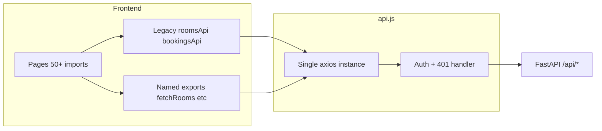

# StayEase — Fix All Issues + Add Features

## Current state (important)

Most of **Part 1 backend work is already done** from prior sessions:

| Area | Status |
|------|--------|
| [`backend/routes/analytics.py`](backend/routes/analytics.py) | `/api/dashboard`, `/api/analytics/occupancy` exist |
| [`backend/routes/waitlist.py`](backend/routes/waitlist.py), [`wishlist.py`](backend/routes/wishlist.py), [`notifications.py`](backend/routes/notifications.py), [`attractions.py`](backend/routes/attractions.py) | Exist + registered in [`backend/main.py`](backend/main.py) |
| [`backend/routes/auth.py`](backend/routes/auth.py) | JWT login, bcrypt register, `/me` working |
| Guest pages | BookRoom confirmation/waitlist, RoomDetail weather/attractions, BookingHistory, Login demo creds largely implemented |
| Components | [`OfferBanner.jsx`](frontend/src/components/OfferBanner.jsx), [`MobileBottomNav.jsx`](frontend/src/components/MobileBottomNav.jsx), [`FilterBar.jsx`](frontend/src/components/FilterBar.jsx) exist; CSS classes already in [`index.css`](frontend/src/index.css) |

**Strategy:** gap-fill and spec-alignment, not blind rewrites. **No `index.css` edits.** **Dual-export `api.js`** per your choice.

---

## Phase 1 — API layer ([`frontend/src/api/api.js`](frontend/src/api/api.js))

**Do not replace outright.** Restructure to:

1. **Single axios instance** with `VITE_API_BASE_URL` (keep `stayease_token` / `stayease_user` as canonical keys; also read legacy `stayease-token` once for migration).
2. **Add all spec named exports** (returning `.data`):
   - `fetchRooms`, `fetchRoom`, `createRoom`, `updateRoom`, `deleteRoom`, `recommendRooms`
   - `createBooking`, `fetchBookings`, `fetchBooking`, `cancelBooking`, `payBooking`
   - `loginUser`, `registerUser`, `fetchMe`, `updateProfile`
   - `submitReview`, `fetchRoomReviews`, `calculatePrice`
   - `validateOffer`, `fetchOffers`, `createOffer`, `deleteOffer`
   - `fetchDashboard`, `fetchAnalytics`
   - `joinWaitlist`, `checkWaitlist`, `toggleWishlist`, `fetchWishlist`
   - `fetchWeather`, `fetchAttractions`, `fetchNotifications`, `markNotificationRead`
3. **Keep legacy namespace objects** (`roomsApi`, `bookingsApi`, `authApi`, etc.) pointing at the same instance — zero breakage for ~50 importers.
4. **Keep `normalizeError`** and attach `error.normalized` in response interceptor (spec’s plain-string reject would break every page).
5. **401 handler:** `clearAuthStorage()` + redirect `/login` (already mostly done).
6. **Add missing legacy helpers** used by existing pages but absent from spec: `inquiriesApi`, `referralsApi`, `invoicesApi`, `hostsApi`, `formatCurrency`, `roomId`, file-upload helpers on `roomsApi`.

New pages/features will prefer named exports; existing pages can migrate gradually.

---

## Phase 2 — Backend tweaks (verify + small deltas)

### Already working — verify only
- [`backend/routes/auth.py`](backend/routes/auth.py): bcrypt via `hash_password`, JWT on login/register, `/me` via `get_current_user`.
- All route modules registered in [`backend/main.py`](backend/main.py) (lines 81–95).

### Dashboard shape alignment ([`backend/routes/analytics.py`](backend/routes/analytics.py))
User spec wants `monthly_revenue: [{ month, revenue, bookings }]`. Current host dashboard returns `{ month, revenue, occupancy }`.

- Add per-month **booking count** to `monthly_revenue` (keep `occupancy` for backward compat with [`HostDashboard.jsx`](frontend/src/pages/host/HostDashboard.jsx) and [`Analytics.jsx`](frontend/src/pages/host/Analytics.jsx)).
- Ensure global (non-role) stats match spec when called by host: `total_rooms`, `available_rooms`, `booked_rooms`, booking status counts, `total_revenue`.

### Bookings for availability calendar
- [`GET /api/bookings/room/{id}`](backend/routes/bookings.py) already exists (host-auth). For guest calendar on RoomDetail, either:
  - **Option A (preferred):** add public `GET /api/rooms/{id}/booked-dates` returning only `{ ranges: [{check_in, check_out}] }` for confirmed bookings (no PII), or
  - **Option B:** use existing endpoint with guest token if user is logged in.
- Plan uses **Option A** — minimal new route in [`backend/routes/rooms.py`](backend/routes/rooms.py), register in main.

---

## Phase 3 — Critical page fixes (gap-fill)

### FIX 4 — [`BookRoom.jsx`](frontend/src/pages/guest/BookRoom.jsx) (spec-simple form)
Per your choice: **simple name + phone form**, auto-fill from `user.name` / `user.phone`, map to backend `staying_guest_name` / `staying_guest_phone` + `booking_for: "self"`.

| Spec item | Action |
|-----------|--------|
| Room card at top | Keep/enhance existing summary card |
| Guest name/phone inputs | Replace `BookingGuestVerification` block with simple required fields |
| Guest stepper, date pickers | Keep `DatePicker` + min-date logic |
| Offer Apply button | Wire `validateOffer(code)` → green/red feedback before submit |
| Live pricing | Keep `useRoomPricing` / `calculatePrice` + `PriceBreakdown` |
| Success card | Already exists — align copy to spec (✅, nights, GST total, receipt + bookings links) |
| 409 waitlist | Already has banner + `WaitlistModal` — switch to **inline form** per spec with pre-filled name/phone |
| Spinner / ErrorMessage | Ensure on all async paths |

### FIX 5 — [`RoomDetail.jsx`](frontend/src/pages/guest/RoomDetail.jsx)
**Do not strip working modals/host card.** Restructure layout to match spec:

- **Left:** title/location, swap `RoomImageGallery` → [`RoomImageCarousel`](frontend/src/components/RoomImageCarousel.jsx), badges, description, amenities, weather (existing), attractions with pills (existing), reviews via `fetchRoomReviews` + last 3 cards with avatar initials.
- **Right sticky card:** price/night, date inputs, guest stepper, live `calculatePrice`, Reserve → `/book/:id?check_in&check_out&guests`, wishlist heart toggle, policy times.
- **NEW:** availability mini-calendar in sticky card (Phase 4 feature 2).

### FIX 6 — [`HostDashboard.jsx`](frontend/src/pages/host/HostDashboard.jsx)
Mostly done. Add:
- Separate `fetchBookings({ host_id })` for recent table (guest name, room, dates, amount, status) if not already enriched.
- Quick action buttons: Add Room, Manage Rooms, View Bookings, Analytics.
- Revenue chart from `monthly_revenue`.

### FIX 7 — [`RoomForm.jsx`](frontend/src/pages/host/RoomForm.jsx)
Already has ~90% of spec fields. Gap-fill:
- Confirm edit mode via `:id` pre-fill (via [`EditRoom.jsx`](frontend/src/pages/host/EditRoom.jsx)).
- Success toast + redirect `/host/rooms` after 1.5s.
- Pincode field already in state — ensure payload maps to `location`.

**Do not remove [`AddRoom.jsx`](frontend/src/pages/host/AddRoom.jsx)** wizard route — it remains the full listing flow; `RoomForm` stays the edit/simple path.

### FIX 8 — [`ManageRooms.jsx`](frontend/src/pages/host/ManageRooms.jsx)
Already has table/toggle/delete. Align:
- Fetch with `host_id` filter (not all rooms).
- Edit route → `/host/rooms/edit/:id` (match [`App.jsx`](frontend/src/App.jsx) routes).

### FIX 9 — [`Login.jsx`](frontend/src/pages/auth/Login.jsx)
Add **Demo guest login** and **Demo host login** buttons that pre-fill `guest@stayease.com` / `host@stayease.com` + `demo123` and submit. Keep empty-field validation + inline error.

### FIX 10 — [`BookingHistory.jsx`](frontend/src/pages/guest/BookingHistory.jsx)
Mostly done. Add per spec:
- **Inline review form** (alternative to modal) for completed bookings: `StarRating`, title, body, would_recommend → `submitReview`.
- GST amount on card.
- Empty state copy: "No bookings yet. Find a room →".

---

## Phase 4 — New features

### 1. Smart search on Home ([`Home.jsx`](frontend/src/pages/guest/Home.jsx))
- Add hero [`SearchBar`](frontend/src/components/SearchBar.jsx) above grid using existing `.search-pill` classes (already styled in CSS).
- Enhance [`FilterBar`](frontend/src/components/FilterBar.jsx) usage: category pills (Single/Double/Triple/Suite/Villa), sort, available-only, price min/max, food, view — **mostly exists**; add "X rooms found" count + grid-rooms 3/2/1 responsive layout when filters active.
- Empty state: "No rooms match your filters".

### 2. Availability calendar (RoomDetail sticky card)
- New component `AvailabilityCalendar.jsx` (inline CSS in component, no index.css change): current + next month, green/red dates from `GET /api/rooms/{id}/booked-dates`.
- Show on check-in input focus/hover.

### 3. Quick compare rooms (Home)
- Compare checkbox on [`RoomCard`](frontend/src/components/RoomCard.jsx) (optional prop).
- Sticky bottom bar "Compare (N)" when 1–3 selected.
- Modal `CompareRoomsModal.jsx` with comparison table + Book buttons per column.

### 4. Guest spend tracker ([`Profile.jsx`](frontend/src/pages/guest/Profile.jsx))
- New "My Spending" tab: compute from `fetchBookings({ guest_id })` client-side — total spent, nights, avg/night, GST, monthly bar chart (Recharts), top city, status pie chart.

### 5. Offer banner ([`OfferBanner.jsx`](frontend/src/components/OfferBanner.jsx) + Home)
- Fetch `fetchOffers()` on mount.
- Rotate active offers every 4s, copy-to-clipboard, sessionStorage dismiss.
- Import in Home above hero.

### 6. Host offer management ([`ManageOffers.jsx`](frontend/src/pages/host/ManageOffers.jsx))
- Full CRUD: create form (code, type, value, min amount, dates, usage limit), PATCH active toggle, DELETE, expired badge, usage progress bar.

### 7. Mobile bottom nav ([`MobileBottomNav.jsx`](frontend/src/components/MobileBottomNav.jsx))
- Expand tabs to: **Home | Search | Trips | Saved | Profile** (Search opens existing mobile search modal or `/` with search focus).
- Already mounted in [`App.jsx`](frontend/src/App.jsx) — update items only; CSS classes exist.

### 8. Print-ready receipt ([`Receipt.jsx`](frontend/src/pages/guest/Receipt.jsx))
- Rewrite layout: centered 680px invoice card with header, guest/room columns, price table (base, breakdown, CGST/SGST, grand total), QR placeholder, print button.
- Add `<style>` print block in component (hide nav/footer/buttons) — **not** in index.css.

---

## Phase 5 — Tests & verification

- Update [`frontend/src/tests/pages/HostDashboard.test.jsx`](frontend/src/tests/pages/HostDashboard.test.jsx) and [`BookRoom.test.jsx`](frontend/src/tests/pages/BookRoom.test.jsx) for new exports/mocks.
- Run `pytest tests/` and `npm run test`.
- Manual checklist from spec (all 11 confirm items).

---

## Files touched (primary)

| File | Change type |
|------|-------------|
| [`frontend/src/api/api.js`](frontend/src/api/api.js) | Dual-export expansion |
| [`backend/routes/analytics.py`](backend/routes/analytics.py) | monthly_revenue.bookings |
| [`backend/routes/rooms.py`](backend/routes/rooms.py) | booked-dates endpoint |
| [`frontend/src/pages/guest/BookRoom.jsx`](frontend/src/pages/guest/BookRoom.jsx) | Simple form + inline waitlist + offer apply |
| [`frontend/src/pages/guest/RoomDetail.jsx`](frontend/src/pages/guest/RoomDetail.jsx) | Layout + carousel + calendar |
| [`frontend/src/pages/guest/Home.jsx`](frontend/src/pages/guest/Home.jsx) | Hero search + compare + OfferBanner |
| [`frontend/src/pages/guest/Receipt.jsx`](frontend/src/pages/guest/Receipt.jsx) | Print-ready rewrite |
| [`frontend/src/pages/guest/Profile.jsx`](frontend/src/pages/guest/Profile.jsx) | Spending tab |
| [`frontend/src/pages/guest/BookingHistory.jsx`](frontend/src/pages/guest/BookingHistory.jsx) | Inline review |
| [`frontend/src/pages/auth/Login.jsx`](frontend/src/pages/auth/Login.jsx) | Demo buttons |
| [`frontend/src/pages/host/ManageOffers.jsx`](frontend/src/pages/host/ManageOffers.jsx) | Full CRUD |
| [`frontend/src/components/OfferBanner.jsx`](frontend/src/components/OfferBanner.jsx) | Rotate + copy |
| [`frontend/src/components/MobileBottomNav.jsx`](frontend/src/components/MobileBottomNav.jsx) | 5-tab nav |
| New: `AvailabilityCalendar.jsx`, `CompareRoomsModal.jsx` | Feature components |

---

## Risk notes

- **BookRoom simplification** drops visible identity upload; backend still accepts optional verification — logged-in users book as self with profile data.
- **RoomImageCarousel** is simpler than Gallery; spec explicitly requests it — Gallery remains available if preview quality regresses.
- **Compare + calendar** use component-scoped inline styles to respect "no index.css changes".
