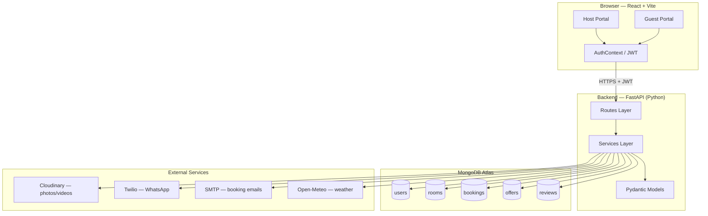
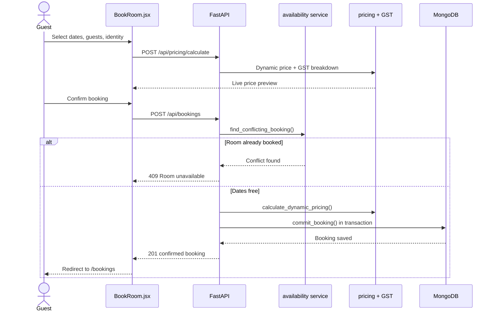
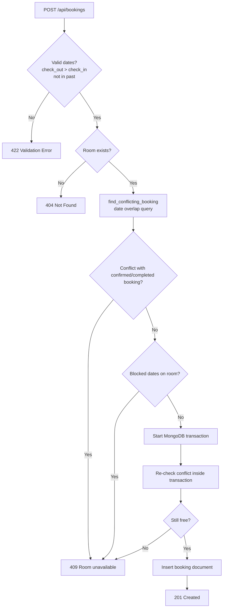
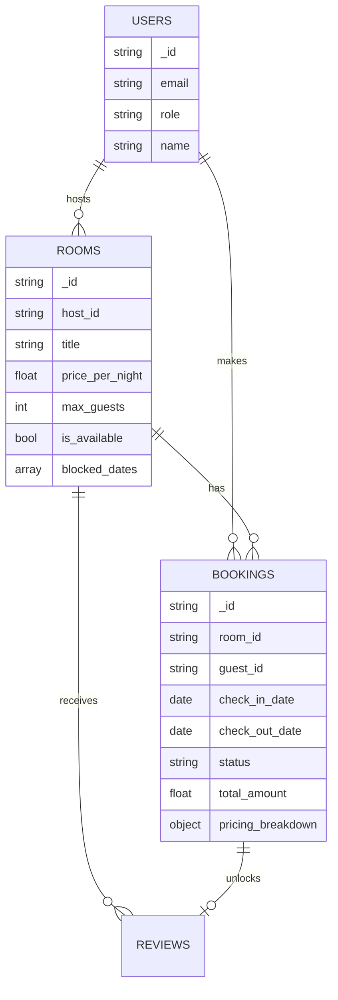
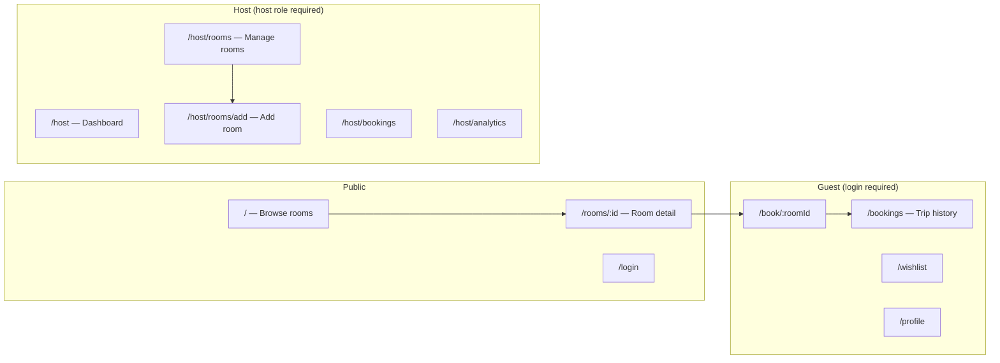
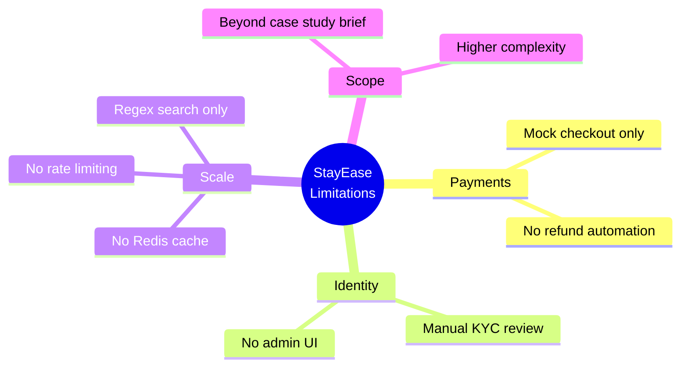
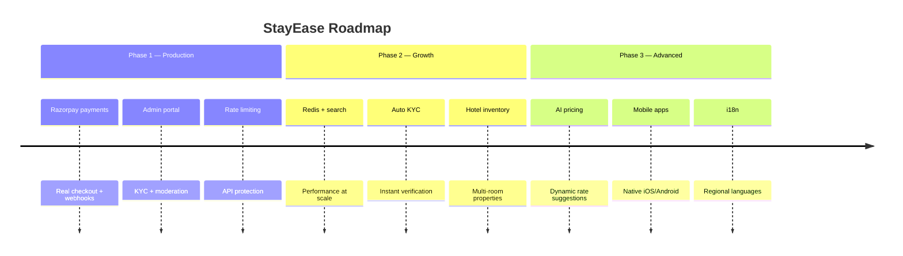
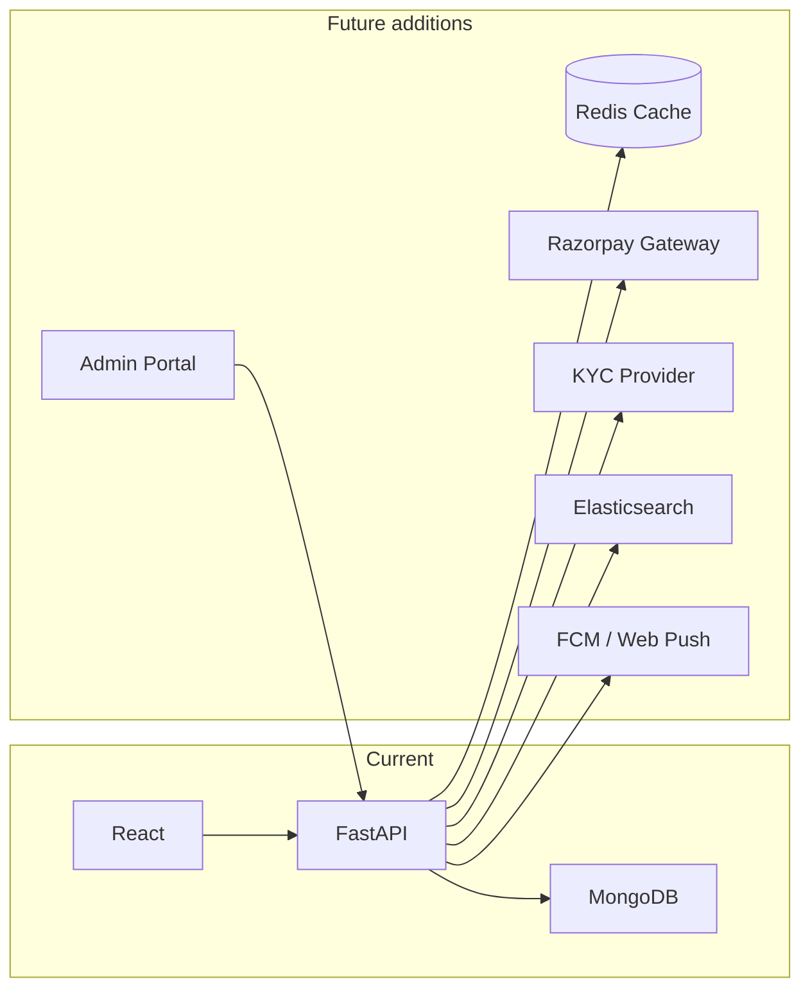

# StayEase — Case Study Submission Handout

**Candidate:** Ananth  
**Project:** Hotel Booking System (StayEase)  
**GitHub:** https://github.com/tan1ro/StayEase  
**Submission date:** 18 June 2026  
**Interview:** 19 June 2026 (hard copy)

---

## 1. Case Study Requirements — Checklist

| Requirement | Implemented | How |
|-------------|-------------|-----|
| Add and view rooms | Yes | Host portal: `/host/rooms/add`, `/host/rooms` → `POST /api/rooms`, `GET /api/rooms` |
| Book a room | Yes | Guest flow: `/book/:roomId` → `POST /api/bookings` |
| Prevent double booking | Yes | Date-overlap query + MongoDB transaction re-check → HTTP 409 |
| Store booking details | Yes | MongoDB `bookings` collection (dates, guest, pricing, GST, status) |
| Display booking history | Yes | Guest page: `/bookings` → `GET /api/bookings?guest_id=...` |

---

## 2. Project Overview

StayEase is a full-stack hotel booking platform built for the Indian market. It has two portals:

- **Guest portal** — search rooms, book stays, view trip history, reviews, wishlist
- **Host portal** — add/manage rooms, handle bookings, offers, analytics

The assignment asked for five core features. StayEase implements all of them and adds GST pricing, identity verification, waitlist, reviews, and host analytics on top.

**Architecture in one line:** React (Vite) SPA → FastAPI REST API → MongoDB Atlas

---

## 3. System Architecture

Paste this Mermaid block into [mermaid.live](https://mermaid.live) or Gemini to render as a diagram.



### Layer breakdown

| Layer | Location | Responsibility |
|-------|----------|----------------|
| Frontend | `frontend/src/` | UI, routing, forms, API calls via Axios |
| API routes | `backend/routes/` | HTTP endpoints, auth guards, validation |
| Services | `backend/services/` | Business logic (pricing, GST, booking commit, availability) |
| Models | `backend/models/` | Pydantic schemas for request/response/DB documents |
| Database | MongoDB Atlas | Persistent storage via Motor async driver |

---

## 4. Core Booking Flow



---

## 5. Double-Booking Prevention (Key Design Decision)

This is the most important requirement from the case study.



**Overlap logic:** Two date ranges conflict when  
`existing.check_in < requested.check_out` AND `existing.check_out > requested.check_in`

**Why two checks?** First check gives a fast 409 response. Transaction re-check prevents race conditions when two users book the same room at the same time.

**Code locations:**
- `backend/services/waitlist.py` — `find_conflicting_booking()`
- `backend/services/booking_commit.py` — `commit_booking()` with transaction
- `backend/tests/test_bookings.py` — `test_double_booking_prevention`

---

## 6. Data Model (Core Collections)



---

## 7. Frontend Route Map (Simplified)



---

## 8. Technology Stack

| Layer | Technology | Purpose |
|-------|------------|---------|
| Backend | FastAPI (Python 3.11+) | REST API, async handlers |
| Database | MongoDB Atlas + Motor | Document store, async queries |
| Frontend | React 18 + Vite | Single-page application |
| Auth | JWT (python-jose + passlib) | Stateless login tokens |
| Validation | Pydantic v2 | Request/response schemas |
| File upload | Cloudinary | Room photos and videos |
| PDF | ReportLab | GST invoices and receipts |
| Email | FastAPI-Mail | Booking confirmations |
| WhatsApp | Twilio API | Booking alerts (sandbox) |
| Testing | Pytest + Vitest | Backend and frontend tests |
| CI/CD | GitHub Actions | Automated test runs |

---

## 9. Setup and Run Instructions

### Prerequisites
- Python 3.11+
- Node.js 20+
- MongoDB Atlas account (free M0 tier)
- Git

### Backend

```bash
cd backend
python -m venv .venv
source .venv/bin/activate          # Windows: .venv\Scripts\activate
pip install -r requirements.txt
cp .env.example .env               # Set MONGO_URI, MONGO_DB_NAME, JWT_SECRET
python seed.py                     # Creates demo users, rooms, bookings
uvicorn main:app --reload          # http://localhost:8000
```

Swagger docs: http://localhost:8000/docs

### Frontend

```bash
cd frontend
npm install
cp .env.example .env               # VITE_API_BASE_URL=http://localhost:8000
npm run dev                        # http://localhost:5173
```

### Demo credentials

| Role | Email | Password |
|------|-------|----------|
| Guest | guest@stayease.com | demo123 |
| Host | host@stayease.com | demo123 |

### Run tests

```bash
cd backend && pytest tests/ -v
cd frontend && npm run test
```

---

## 10. Assumptions Made

1. **Payment is mocked** — "Mark as paid" button instead of Razorpay/Stripe integration
2. **Login required** — guests must register/login to book and view history
3. **Host role** — only hosts can add/edit rooms; guests browse and book
4. **GST slabs (India hotel tariff):**
   - Below ₹1,000/night → 0%
   - ₹1,000–₹7,500/night → 12%
   - Above ₹7,500/night → 18%
5. **Identity verification** — guest uploads Aadhar/PAN/Passport; manual review assumed
6. **WhatsApp** — requires Twilio sandbox credentials in `.env`
7. **Cloudinary free tier** — used for photo/video storage
8. **Referral credits** — applied as checkout discount, not real money transfer

---

## 11. AI Tools Used (1–2 Paragraph Summary)

I built this project using **Claude (Anthropic)** as my primary AI development partner and **Cursor IDE** with AI assistance for real-time code suggestions.

Claude helped me design the full system architecture, generate FastAPI route handlers with proper async Motor MongoDB integration, build the React component tree, implement the GST calculation service following India's hotel tariff slabs, and design the double-booking prevention logic using date overlap queries. Cursor's inline AI suggestions accelerated writing repetitive boilerplate like Pydantic models and API layer functions.

The most challenging part was converting synchronous route handlers to fully async Motor MongoDB calls while preserving FastAPI's dependency injection for JWT authentication. Claude helped me debug the lifespan context manager pattern for database connection management. Another challenge was implementing the dynamic pricing engine with correctly stacking multipliers — Claude walked me through the order of operations to ensure weekend surcharges, peak season adjustments, and offer code discounts applied in the right sequence.

---

## 12. Feature Summary (Beyond Core Requirements)

| Feature | Guest | Host |
|---------|-------|------|
| Room search and filters | Yes | — |
| Smart room recommender | Yes | — |
| Dynamic pricing + GST preview | Yes | — |
| Booking with identity verification | Yes | — |
| Trip history + cancellation | Yes | — |
| Reviews (post-checkout) | Yes | Reply to reviews |
| Wishlist | Yes | — |
| Waitlist (auto-notify on cancel) | Yes | — |
| Add / edit / delete rooms | — | Yes |
| Manage bookings | — | Yes |
| Promotional offers | Apply at checkout | Create offers |
| Analytics dashboard | — | Yes |
| GST invoice PDF | Download | — |
| Host messaging | Yes | Yes |

---

## 13. Drawbacks and Current Limitations

Honest assessment of what the system does **not** do well yet, or where trade-offs were made for the case study timeline.

### Functional gaps

| Drawback | Impact | Why it exists |
|----------|--------|---------------|
| **Mock payment gateway** | No real money collection, refunds, or payment webhooks | Razorpay/Stripe integration deferred; "Mark as paid" simulates checkout |
| **Manual identity verification** | Admin must review uploaded Aadhar/PAN/Passport docs | No third-party KYC API (Digio, HyperVerge) integrated |
| **No admin portal** | Host/guest moderation, identity approval, and listing reports need direct DB or API access | Admin role exists in backend but no dedicated UI |
| **Login required to book** | Cannot book as anonymous guest | JWT auth chosen for user-specific history and security |
| **Single-property model** | Each room is a separate listing, not a multi-room hotel inventory system | Simpler document model; no floor/room-number auto-assignment engine |
| **WhatsApp in sandbox only** | Alerts work only with Twilio sandbox numbers | Production WhatsApp Business API needs approval and billing |
| **Email optional in dev** | Booking emails may not send if SMTP is not configured | Returns mock response when mail credentials are missing |

### Technical limitations

| Drawback | Impact | Mitigation path |
|----------|--------|-----------------|
| **No Redis / caching** | Room search hits MongoDB on every request; slower at scale | Add Redis cache for popular searches and room detail pages |
| **No rate limiting** | Booking endpoint could be spammed or brute-forced | Add slowapi or nginx rate limits on `/api/bookings` |
| **JWT without refresh tokens** | User must re-login when token expires | Add refresh token rotation or shorter sessions with silent renew |
| **MongoDB transactions require replica set** | Local dev may skip true transactions if not on Atlas replica set | Production uses Atlas M0+ which supports transactions |
| **Limited E2E tests** | Pytest/Vitest cover units; no full browser automation (Playwright/Cypress) | Add E2E suite for booking happy path |
| **No full-text search engine** | Room search uses MongoDB regex, not Elasticsearch/Atlas Search | Fine for demo; weak for large catalogues |
| **Referral credits are in-app only** | Not withdrawable real currency | By design for demo discount logic |
| **Scope creep vs case study** | Many extra features (reviews, analytics, messaging) beyond the 5 core requirements | Shows capability but increases complexity for reviewers |

### UX / product trade-offs

- **Host onboarding is multi-step** — powerful but heavier than a simple "add room" form the case study implied.
- **GST and identity flows add friction** — realistic for India but more steps than a minimal booking demo.
- **Mobile-responsive but not a native app** — no push notifications offline; relies on web + email/WhatsApp.
- **English-only UI** — no i18n/localization for regional languages.



---

## 14. Future Features and Roadmap

Planned improvements if this were taken to production.

### Phase 1 — Production readiness (short term)

| Feature | Description | Priority |
|---------|-------------|----------|
| **Razorpay integration** | Real UPI/card payments, webhooks for confirm/fail/refund | High |
| **Admin dashboard** | Approve identity docs, moderate listings, view reports | High |
| **Rate limiting + API throttling** | Protect booking and auth endpoints from abuse | High |
| **Refresh tokens** | Better session UX without frequent re-login | Medium |
| **Playwright E2E tests** | Automated full booking flow in CI | Medium |

### Phase 2 — Growth features (medium term)

| Feature | Description | Priority |
|---------|-------------|----------|
| **Redis caching** | Cache room listings, search results, dashboard stats | High |
| **Elasticsearch / Atlas Search** | Fast full-text and geo search across cities | Medium |
| **Automated KYC** | Digio/HyperVerge API for Aadhar/PAN verification | Medium |
| **Push notifications** | Web push or Firebase for booking updates | Medium |
| **Multi-room hotel inventory** | One property, many room numbers, auto-assign on check-in | Medium |
| **Channel manager sync** | Connect to OTA feeds (MakeMyTrip, Booking.com style) | Low |

### Phase 3 — Advanced (long term)

| Feature | Description | Priority |
|---------|-------------|----------|
| **AI pricing recommendations** | Suggest optimal nightly rates from occupancy trends | Medium |
| **Chatbot concierge** | AI assistant for guest FAQs and booking help | Low |
| **Loyalty programme** | Tiered rewards beyond referral credits | Low |
| **Multi-language UI** | Hindi, Kannada, Tamil for regional users | Medium |
| **Native mobile apps** | React Native or Flutter for iOS/Android | Low |
| **Blockchain receipts** | Optional tamper-proof invoice audit trail | Low |



### Future architecture (with planned services)



---

## 15. Validation and Error Handling

| Scenario | HTTP code | Example |
|----------|-----------|---------|
| Past check-in date | 422 | "Cannot book past dates" |
| Check-out before check-in | 422 | "Check-out must be after check-in" |
| Room not found | 404 | Invalid room ID |
| Double booking | 409 | "Room unavailable for selected dates" |
| Blocked host dates | 409 | Same as double booking |
| Unauthenticated | 401 | Missing/invalid JWT |
| Wrong role (host-only route) | 403 | Guest accessing host endpoint |
| Offer exhausted | 422 | Usage limit reached |

---

## 16. Interview Talking Points

Use these if asked to walk through the project:

1. **Why MongoDB?** Flexible schema for room amenities, photos, pricing breakdowns; good fit for a booking document model.
2. **How do you prevent double booking?** Date overlap query on confirmed/completed bookings, then a second check inside a MongoDB transaction before insert.
3. **How is auth handled?** JWT issued on login; `Authorization: Bearer` header on every protected API call; role-based guards (`tourist`, `host`, `admin`).
4. **How is pricing calculated?** Base price × nights × dynamic multipliers (weekend, peak season, early bird) − offer discount − referral credits + GST per Indian hotel slabs.
5. **What are the main drawbacks?** Mock payments, manual KYC, no admin UI, no caching/rate limiting — acceptable for a case study, not for production.
6. **What would you build next?** Razorpay payments, admin dashboard, Redis caching, and automated KYC — see Section 14 roadmap.

---

## 17. Quick Demo Script (5 minutes)

1. Open http://localhost:5173 — browse rooms on home page (**view rooms**)
2. Login as `host@stayease.com` / `demo123`
3. Go to `/host/rooms/add` — add a room (**add rooms**)
4. Logout → login as `guest@stayease.com` / `demo123`
5. Open a room → Book → pick dates → confirm (**book a room**)
6. Try booking same room/dates again → see 409 error (**double booking prevented**)
7. Go to `/bookings` — see stored booking with status and price (**booking history**)

---

## 18. File Structure (Key Paths)

```
StayEase/
├── README.md                          # Full project documentation
├── CASE_STUDY_SUBMISSION.md           # This handout
├── backend/
│   ├── main.py                        # FastAPI app entry
│   ├── routes/
│   │   ├── rooms.py                   # CRUD + search
│   │   └── bookings.py                # Create, list, cancel
│   ├── services/
│   │   ├── booking_commit.py          # Transactional booking insert
│   │   ├── waitlist.py                # find_conflicting_booking()
│   │   ├── pricing.py                 # Dynamic pricing engine
│   │   └── gst.py                     # India GST slabs
│   ├── models/
│   │   ├── room.py
│   │   └── booking.py
│   └── tests/
│       └── test_bookings.py           # Double-booking test
└── frontend/
    └── src/
        ├── pages/
        │   ├── guest/
        │   │   ├── BookRoom.jsx
        │   │   └── BookingHistory.jsx
        │   └── host/
        │       ├── AddRoom.jsx
        │       └── ManageRooms.jsx
        └── api/api.js                 # Axios API client
```

---

*End of submission handout. Copy sections into Google Docs as needed. Render Mermaid diagrams at https://mermaid.live and paste exported PNG/SVG into your document.*
